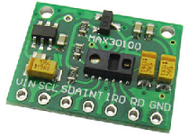

# MAX30100
Maxim Pulse Oximeter and Heart-Rate Sensor Driver for TiJOS

| 条目         | 说明                              |
| ---------- | ------------------------------- |
| 驱动名称       | MAX30100 心率血氧传感器                |
| 适用         | 该驱动适用于Maxim MAX30100心率血氧传感器     |
| 通讯方式       | I2C                             |
| Java Class | TiMAX30100.java                 |
| 图片         |  |

